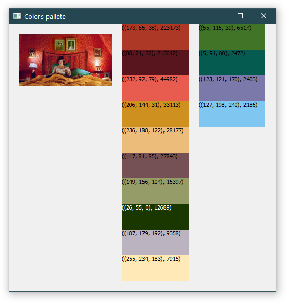
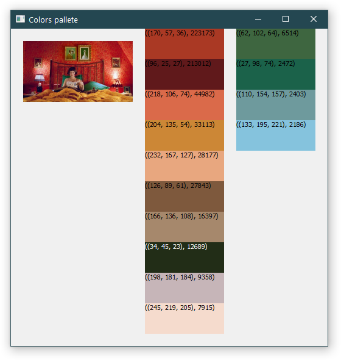

# Get_most_used_colors
 Gets most used color from image

### How to run
`get_most_colors.py`

In script change variable `file` by your filepath.

### Libs to install
`pip install Pillow`
`pip install PyQt5`

`get_most_colors_with_average_colors.py` doesn't seems to be usefull. I experimenting there with calculating average color in each color group and output it as result.

