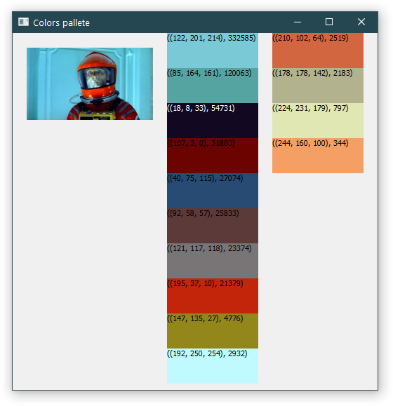

# Get_most_used_colors
 Gets most used color from image

### How to run
`get_most_colors.py`

In script change variable `file` by your filepath.

### Libs to install
`pip install Pillow`
`pip install PyQt5`

